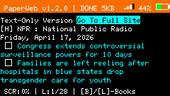
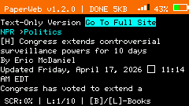

# PaperWeb v1.2.0

  

A web browser for your M5Cardputer. Because why not.

## What it does

Reads HTML on the fly, shows text and links. No JS, no CSS, no nonsense. Just pages.

**Now with offline mode** — save pages to SD, browse files, read saved stuff anywhere.

## Controls (short version)

| Key | What it does |
|-----|---------------|
| `ENTER` | Go to URL / Search |
| `TAB` | WiFi settings |
| `,` / `/` | Choose link |
| `;` / `.` | Scroll |
| `` ` `` | Back / Exit |
| `D` | Save page to SD (.txt) |
| `OPT` | File manager |
| `S` | Screenshot |
| `B` / `L` | Bookmarks |

## Install

1. Get the `.bin` file from [Releases](../../releases)
2. Flash with M5Burner
3. Put an SD card in (for saving pages)
4. Connect to WiFi (`TAB`) and go.

## Known problems

- Big sites load slow — it's an ESP32, not a gaming PC.
- Bookmark menu lags sometimes. I'll fix it eventually.
- File browser shows first 50 files only.

## Build

Arduino IDE, board ESP32-S3 Dev Module, 8MB flash. Libraries: M5Cardputer, M5Unified, efont, SD, zlib.

## License

MIT — do whatever.

— [Artem76228](https://github.com/Artem76228)  
Star if this actually worked for you.
