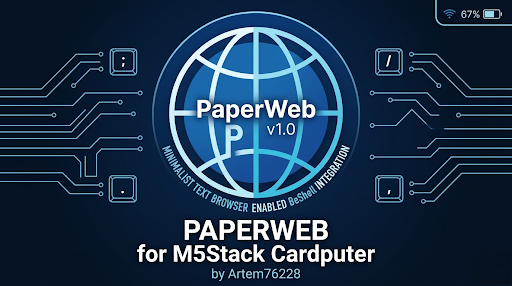

# 📟 PaperWeb v1.1.0
---

---
A text-based web browser for the **M5Stack Cardputer**.  
Because browsing the web on a microcontroller is a flex.

## Why?

The Cardputer is an ESP32 with a screen and a keyboard. It needed a browser. So I made one.

PaperWeb streams and parses HTML on the fly, pulls out text and links, and renders it all on a 240×135 display. No JavaScript, no CSS, no bloat. Just text and links.

## Features

- **gzip/deflate** — modern sites are compressed, this handles it
- **Cyrillic support** — Russian and Ukrainian text renders fine
- **Link navigation** — `,` and `/` to jump, `ENTER` to follow, highlighted in cyan
- **Browsing history** — `DEL` goes back (up to 10 steps)
- **Bookmarks** — `B` saves current page, `L` opens menu (5 slots)
- **Screenshots** — `S` saves screen as BMP to SD card
- **WiFi Manager** — store up to 3 networks
- **Session cookies** — stays logged in on websites
- **Smart search** — type words without dots → Google search

## Controls

| Key | Action |
|-----|--------|
| `ENTER` | Open URL / Search |
| `TAB` | WiFi Manager |
| `,` / `/` | Previous / Next link |
| `;` / `.` | Scroll up / down |
| `=` / `-` | Zoom in / out |
| `` ` `` | Exit / Back |
| `DEL` | History back |
| `B` | Save bookmark |
| `L` | Open bookmarks menu |
| `S` | Screenshot to SD |

## Installation

1. Download `PaperWeb_v1.1.0.bin` from [Releases](../../releases)
2. Flash using **M5Burner** or **ESP32 Download Tool**
3. Insert microSD card for screenshots (optional)
4. Open WiFi Manager (`TAB`), connect to network
5. Browse the web like it's 1995

## Screenshots

| Google Search (cyrillic) | NPR Text Version |
|--------------------------|------------------|
|  |  |

## What's New in v1.1.0

- **Bookmarks** — finally, don't have to retype URLs
- **Screenshots** — press `S`, get a BMP on SD
- **Session cookies** — stays logged in
- **Custom DNS** — uses Cloudflare 1.1.1.1, bypasses provider blocks
- **Cleaner rendering** — lists show `•`, headers show `[H]`
- **Smoother loading** — less UI redraws during fetch
- **Code cleanup** — removed dead code, rewrote ugly parts

## Known Issues

- Some heavy sites load slowly. It's an ESP32, not a MacBook.
- Bookmark menu sometimes lags — working on it.
- Enter/Tab may behave differently on Cardputer v1.0 hardware.

## Build It Yourself

Open the `.ino` file in Arduino IDE. Required libraries:
- `M5Cardputer`
- `M5Unified`
- `efont` (for Cyrillic)
- `SD` (built-in)

Board: **ESP32-S3 Dev Module**  
Flash size: **8MB**  
PSRAM: **OPI PSRAM**

## License

MIT — do whatever you want with it.

---

Made by [Artem76228](https://github.com/Artem76228)  
⭐ Star this repo if it worked on your Cardputer
