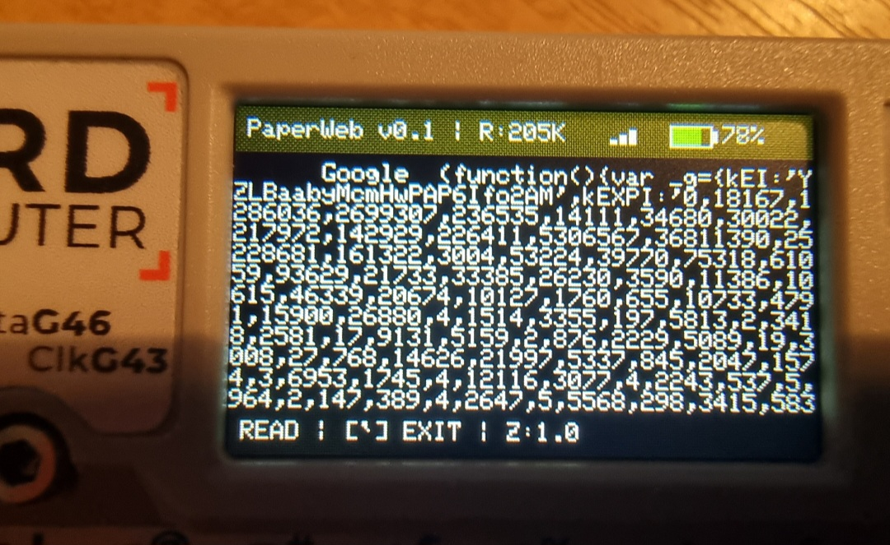
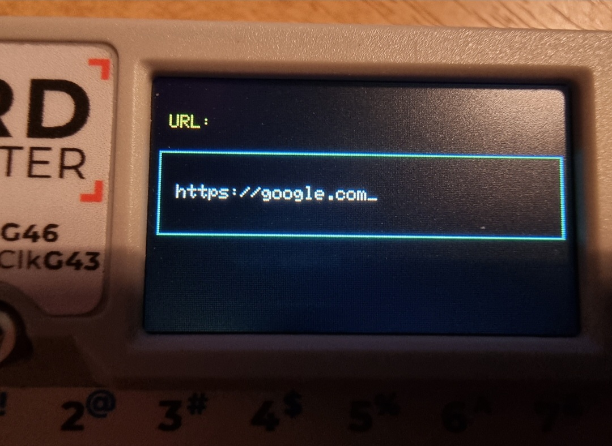
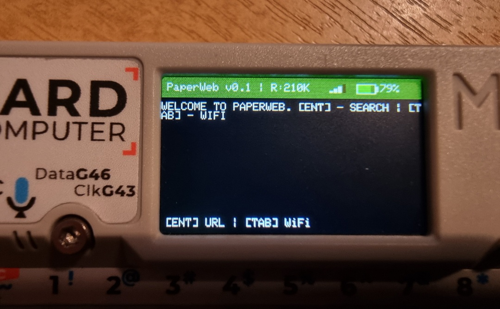

# 🌐 PaperWeb v0.1

  
  
  

**PaperWeb** is a fast, lightweight, and open-source text-based web browser designed specifically for the **M5Stack Cardputer**. Experience the web in its purest form—no ads, no distractions, just information.

---

## 🚀 Key Features
- **Modern Web Support:** Fully supports HTTPS/SSL connections.
- **Dynamic UI:** Real-time status bar with Battery percentage, WiFi signal strength (RSSI), and RAM usage.
- **Smart Connectivity:** Built-in WiFi Manager with memory for 3 networks.
- **Customizable Viewing:** Adjustable text zoom and smooth scrolling.
- **Feedback:** Visual progress bar during page loading.

## ⌨️ Controls & Shortcuts
| Key | Action |
| :--- | :--- |
| **[ENTER]** | Open URL input or Search |
| **[TAB]** | Open WiFi Manager |
| **[;] / [.]** | Scroll Up / Down |
| **[=] / [-]** | Zoom In / Out |
| **[`] (Backquote)** | Exit Reading Mode / Go Back |

## 🛠️ Installation
1. Go to the [Releases](https://github.com/Artem76228/PaperWeb/releases) section.
2. Download the `PaperWeb_v0.1.bin` file.
3. Flash it to your M5Stack Cardputer using **M5Burner** or **ESP32 Download Tool**.

## 📖 Technical Details
- **Core:** Built on ESP32-S3.
- **Library:** Uses `M5Cardputer`, `WiFiClientSecure`, and `HTTPClient`.
- **Filtering:** Intelligent HTML tag stripping for clean text output.

---
*Created by [Artem76228](https://github.com/Artem76228)*
